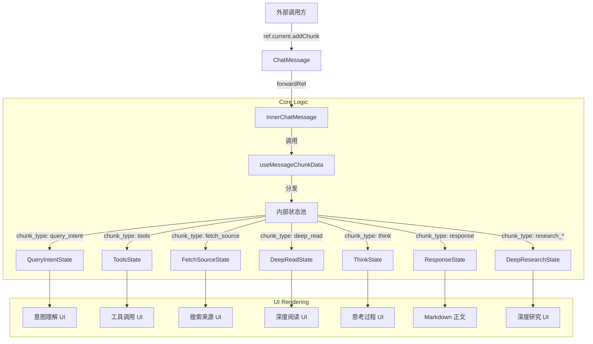

# @infinilabs/chat-message 技术架构文档

## 1. 概述

`@infinilabs/chat-message` 是一个基于 React 的高度封装的聊天消息流渲染组件库。它专为大模型（LLM）对话场景设计，能够处理复杂的消息流（Stream），包括文本响应、思考过程（Think）、工具调用（Function Calling）、联网搜索（Web Search）、深度阅读（Deep Read）以及深度研究（Deep Research）等多种交互形态。

该组件库的核心目标是提供一个**开箱即用**、**状态自管理**且**高度可定制**的对话消息 UI 解决方案，使得开发者只需关注数据流的传输，而无需处理繁琐的流式渲染逻辑。

## 2. 技术栈与依赖

- **框架核心**: `React 18` + `Vite`
- **样式方案**: `TailwindCSS` + `clsx` + `tailwind-merge`
- **状态管理**: `Zustand` (内部少量使用) + `React Hooks` (主要依赖)
- **Markdown 渲染**: `@ant-design/x-markdown` (基于 `react-markdown` 的增强版)
- **国际化**: `i18next` + `react-i18next`
- **动画**: `framer-motion` (用于流式打字机效果及组件过渡)
- **图表/流程图**: `mermaid` (支持 Mermaid 图表渲染)
- **图标库**: `lucide-react`

## 3. 架构设计

### 3.1 核心设计理念

1.  **流式驱动 (Stream-Driven)**: 组件通过 `addChunk` 方法接收流式数据，内部自动根据 `chunk_type` 分发处理，实现平滑的打字机效果和状态更新。
2.  **分层渲染 (Layered Rendering)**: 将一条完整的 AI 回复拆分为多个独立的功能层（Layer），如意图理解层、工具调用层、搜索来源层、思考层、正文层等。
3.  **状态隔离**: 通过自定义 Hook (`useMessageChunkData`) 将不同类型的流数据状态隔离，避免相互污染。

### 3.2 目录结构

```
packages/ChatMessage/
├── src/
│   ├── components/
│   │   ├── ChatMessage.tsx       # 对外暴露的主入口组件
│   │   ├── index.tsx             # 内部实现逻辑 (InnerChatMessage)
│   │   ├── QueryIntent.tsx       # 意图理解组件
│   │   ├── CallTools.tsx         # 工具调用组件
│   │   ├── FetchSource.tsx       # 搜索来源组件
│   │   ├── DeepRead.tsx          # 深度阅读组件
│   │   ├── Think.tsx             # 思考过程组件
│   │   ├── DeepResearch/         # 深度研究相关组件
│   │   └── ...
│   ├── hooks/
│   │   └── useMessageChunkData.ts # 核心 Hook：处理流数据分发与状态管理
│   ├── types/                    # 类型定义
│   └── utils/                    # 工具函数
```

### 3.3 数据流向图



## 4. 核心机制解析

### 4.1 流式数据处理 (`useMessageChunkData`)

这是整个组件库的“大脑”。它定义了 `query_intent`, `tools`, `fetch_source`, `think`, `response` 等多个独立的状态变量，并提供了一组 `deal_*` 函数来追加数据。

-   **增量更新**: 对于文本类的流（如 `response`），新收到的 chunk 会被拼接到现有字符串后。
-   **结构化更新**: 对于对象类的流（如 `tools`），会根据业务逻辑合并状态。

### 4.2 深度研究 (Deep Research) 状态机

深度研究是一个复杂的多步骤过程，组件内部通过监听特定类型的 chunk (`research_planner_start`, `research_researcher_step_end` 等) 来维护一个隐式的状态机：

1.  **Planning**: 接收 `research_planner_end`，解析 JSON 生成研究计划列表。
2.  **Execution**: 接收 `research_researcher_step_*`，更新当前执行步骤、搜索关键词和结果数量。
3.  **Reporting**: 接收 `research_reporter_start`，进入报告生成阶段。
4.  **Finished**: 接收 `research_reporter_end`，流程结束。

### 4.3 思考过程 (Think) 与正文分离

组件通过检测特殊的 XML 标签 `<think>` 和 `</think>` (或转义字符) 来区分思考内容与正文内容：

-   当检测到 `<think>` 时，后续的 chunk 被路由到 `Think` 组件状态。
-   当检测到 `</think>` 时，后续的 chunk 被路由回 `Response` 正文状态。

这种设计使得组件能够兼容 DeepSeek R1 等包含显式思考过程的模型输出。

## 5. 组件功能详解

| 组件模块 | 对应 Chunk Type | 功能描述 |
| :--- | :--- | :--- |
| **QueryIntent** | `query_intent` | 展示 AI 对用户提问的理解及生成的搜索关键词建议。 |
| **CallTools** | `tools` | 可视化展示工具调用的过程，包括输入参数和执行状态。 |
| **FetchSource** | `fetch_source` | 展示联网搜索检索到的网页来源列表（Favicon + 标题）。 |
| **PickSource** | `pick_source` | 展示 AI 最终决定引用的来源。 |
| **DeepRead** | `deep_read` | 展示深度阅读/解析文件的进度。 |
| **Think** | `think` | 可折叠的思考过程面板，展示模型的思维链 (CoT)。 |
| **DeepResearch** | `research_*` | 复杂的深度研究任务流展示，包含步骤条、搜索详情抽屉等。 |
| **XMarkdown** | `response` | 最终的回答正文，支持代码高亮、公式、表格等富文本渲染。 |

## 6. 扩展性与定制

-   **Theme 支持**: 内置 `light` / `dark` / `system` 主题切换。
-   **国际化**: 内置中英文文案，通过 `locale` 属性控制。
-   **样式覆盖**: 提供 `rootClassName`, `actionClassName` 等 props 用于自定义样式。
-   **Slot 机制**: 虽然当前主要通过 props 配置，但结构上预留了 `MessageActions` 等插槽位。

## 7. 总结

`@infinilabs/chat-message` 不仅仅是一个 Markdown 渲染器，而是一个**全功能的 AI 对话流前端引擎**。它通过高度抽象的数据流接口，将复杂的 AI 交互逻辑（如 RAG 检索、工具调用、深度思考）封装在组件内部，极大地降低了开发 AI 应用前端的门槛。
