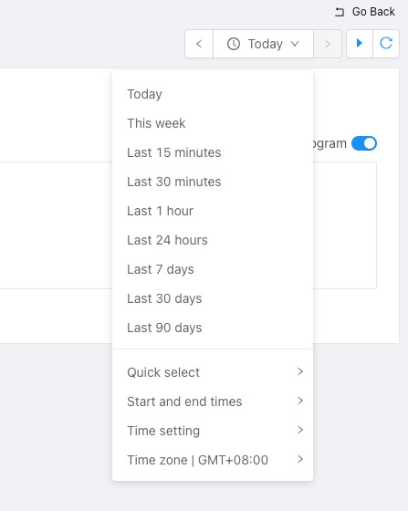
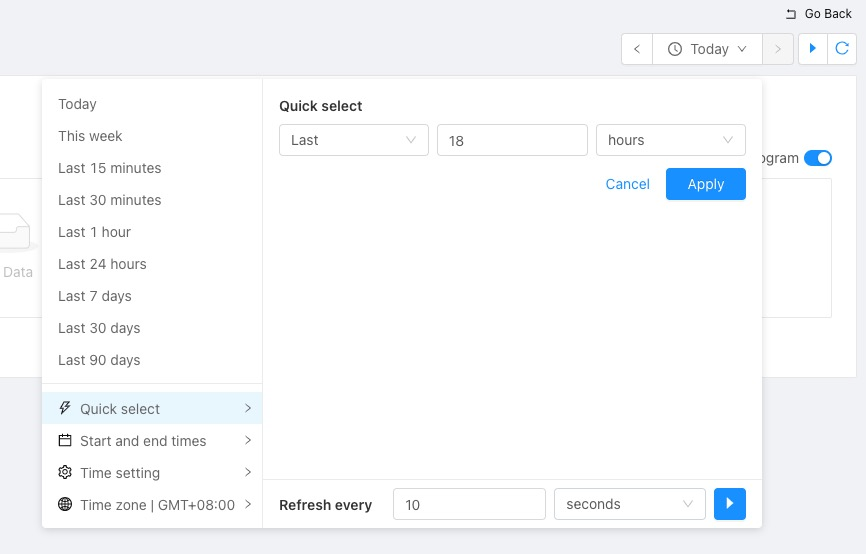
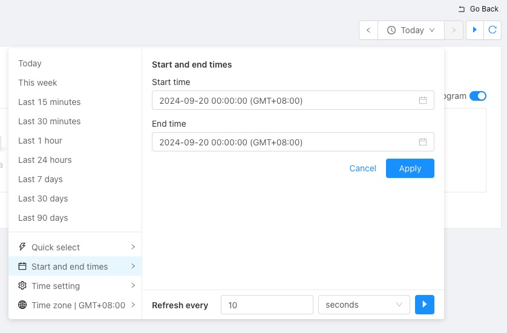
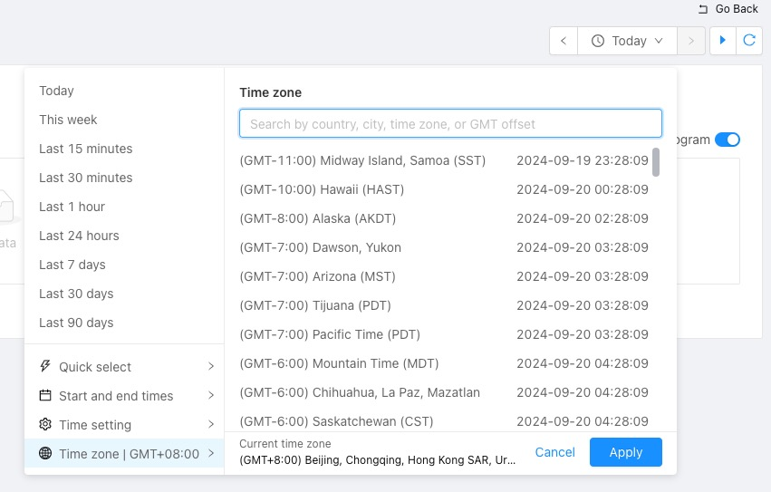

# DatePicker

English | [简体中文](./README-zh_CN.md)

Customized DatePicker component

## Screenshot









## Install

```
npm i @infinilabs/datepicker

# or
cnpm i @infinilabs/datepicker

# or
yarn add @infinilabs/datepicker

# or
pnpm add @infinilabs/datepicker
```

## Usage

```jsx
import DatePicker from "@infinilabs/datepicker";

<DatePicker
  onRangeChange={({ start, end }) => {
    setRange({ start, end });
  }}
  onRefreshChange={setRefresh}
  onTimeSettingChange={(newTimeSetting) => {
    setTimeSetting({ ...timeSetting, ...newTimeSetting });
  }}
  autoFitLoading={autoFitLoading}
  onAutoFit={onAutoFit}
  timeZone={timeZone}
  onTimeZoneChange={setTimeZone}
  recentlyUsedRangesKey={"demo-recently-used-ranges"}
/>
```

## Props

| Property              | Description                                                                                                          | Type                                                            | Default               | Version |
| --------------------- | -------------------------------------------------------------------------------------------------------------------- | --------------------------------------------------------------- | --------------------- | ------- |
| className             | Class name for the root element of the component                                                                      | string                                                          | -                     | 1.0.0   |
| popoverClassName      | Class name for the popover element                                                                                    | string                                                          | -                     | 1.0.0   |
| popoverPlacement      | Popover position options: top, left, right, bottom, topLeft, topRight, bottomLeft, bottomRight, leftTop, leftBottom, rightTop, rightBottom | string                                                          | 'bottom'              | 1.0.0   |
| locale                | Language setting                                                                                                     | string                                                          | 'en-US'               | 1.0.0   |
| dateFormat            | Date format                                                                                                          | string                                                          | 'YYYY-MM-DD HH:mm:ss' | 1.0.0   |
| Start                 | Start date                                                                                                           | string                                                          | 'now-15m'             | 1.0.0   |
| End                   | End date                                                                                                             | string                                                          | 'now'                 | 1.0.0   |
| onRangeChange         | Callback for when the date range changes                                                                              | ({start: string, end: string, isAbsolute?: boolean}) => void    | -                     | 1.0.0   |
| isRefreshPaused       | Whether auto-refresh is paused                                                                                        | boolean                                                         | true                  | 1.0.0   |
| refreshInterval       | Auto-refresh interval (in milliseconds)                                                                               | number                                                          | 10000                 | 1.0.0   |
| onRefreshChange       | Callback for when auto-refresh settings change                                                                        | ({isRefreshPaused: boolean, refreshInterval: number}) => void   | -                     | 1.0.0   |
| onRefresh             | Callback when auto-refresh triggers                                                                                   | ({start: string, end: string, refreshInterval: number}) => void | -                     | 1.0.0   |
| showTimeSetting       | Whether to display time configuration options                                                                         | boolean                                                         | false                 | 1.0.0   |
| shouldTimeField       | Whether a time field must be configured when displaying time settings                                                 | boolean                                                         | true                  | 1.0.0   |
| showTimeField         | Whether to display the time field                                                                                     | boolean                                                         | false                 | 1.0.0   |
| timeField             | Time field for the selected date range                                                                                | string                                                          | -                     | 1.0.0   |
| timeFields            | List of available time fields                                                                                         | string[]                                                        | []                    | 1.0.0   |
| showTimeInterval      | Whether to display time interval options                                                                              | boolean                                                         | false                 | 1.0.0   |
| timeInterval          | Selected time interval                                                                                                | string                                                          | -                     | 1.0.0   |
| onTimeSettingChange   | Callback for when time settings change                                                                                | ({timeField: string, timeInterval: string}) => void             | -                     | 1.0.0   |
| autoFitLoading        | Loading state for auto time adjustment                                                                                | boolean                                                         | false                 | 1.0.0   |
| onAutoFit             | Callback for auto time adjustment                                                                                     | () => void                                                      | -                     | 1.0.0   |
| timeZone              | Time zone setting                                                                                                     | string                                                          | 'Asia/Shanghai'       | 1.0.0   |
| onTimeZoneChange      | Callback for when the time zone changes                                                                               | (timeZone: string) => void                                      | -                     | 1.0.0   |
| commonlyUsedRanges    | Quick select list for commonly used date ranges                                                                       | {start: string, end: string, label: string}[]                   | []                    | 1.0.0   |
| recentlyUsedRangesKey | Key for storing recently used date ranges                                                                             | string                                                          | -                     | 1.0.0   |