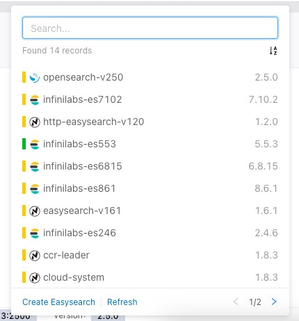

# DropdownList

English | [简体中文](./README-zh_CN.md) 

Customized drop-down list component

## Screenshot




## Install

```bash
npm i @infinilabs/dropdownlist

# or
cnpm i @infinilabs/dropdownlist

# or
yarn add @infinilabs/dropdownlist

# or
pnpm add @infinilabs/dropdownlist
```

## Usage

```jsx
import DropdownList from "@infinilabs/dropdownlist";

<DropdownList
  getPopupContainer={(triggerNode) => triggerNode.parentNode}
  disabled={disabled}
  mode={mode}
  className={className}
  popoverClassName={popoverClassName}
  width={width}
  dropdownWidth={dropdownWidth}
  locale={getLocale()}
  value={value}
  onChange={onChangeCluster}
  rowKey="id"
  loading={loading}
  data={data.map((item) => ({ ...item._source }))}
  extraData={extraData}
  pagination={{}}
  renderItem={(item) => {}}
  renderTag={(item) => item.version}
  searchKey="name"
  onSearchChange={(value) => {}}
  sorter={sorter}
  onSorterChange={setSorter}
  sorterOptions={[]}
  onRefresh={() => {
  }}
  actions={actions}
>
  {children}
</DropdownList>
```

## Props

| Property            | Description                                                 | Type                                                            | Default              | Version |
|---------------------|-------------------------------------------------------------|-----------------------------------------------------------------|----------------------|---------|
| className           | CSS class for the root element                              | string                                                          | -                    | 1.0.0   |
| popoverClassName    | CSS class for the popover element                           | string                                                          | -                    | 1.0.0   |
| popoverPlacement    | Popover placement options (top, left, right, bottom, etc.)   | string                                                          | 'bottomLeft'          | 1.0.0   |
| width               | Width of the dropdown selector                              | number                                                          | 300                  | 1.0.0   |
| dropdownWidth       | Width of the dropdown, defaults to the selector width       | number                                                          | 300                  | 1.0.0   |
| locale              | Language setting                                            | string                                                          | 'en-US'              | 1.0.0   |
| allowClear          | Allow clearing the selected value                           | boolean                                                         | false                | 1.0.0   |
| mode                | Enable multi-selection mode                                 | 'multiple'                                                      | -                    | 1.0.0   |
| value               | Selected value                                              | object                                                          | -                    | 1.0.0   |
| onChange            | Callback for value changes                                  | (value: object) => void                                          | -                    | 1.0.0   |
| disabled            | Disable the dropdown                                        | boolean                                                         | false                | 1.0.0   |
| placeholder         | Placeholder text in the selector                            | string                                                          | -                    | 1.0.0   |
| loading             | Show loading state                                          | boolean                                                         | false                | 1.0.0   |
| failed              | Show failure state                                          | boolean                                                         | false                | 1.0.0   |
| data                | Data source for the dropdown list                           | []                                                              | []                   | 1.0.0   |
| rowKey              | Key for each row in the data list                           | string                                                          | -                    | 1.0.0   |
| renderItem          | Custom render function for each list item                   | (item: object) => ReactNode                                      | -                    | 1.0.0   |
| renderTag           | Custom tag render function                                  | (item: object) => ReactNode                                      | -                    | 1.0.0   |
| renderLabel         | Custom render function for the selected label               | (item: object) => ReactNode                                      | -                    | 1.0.0   |
| renderEmptyList     | Custom render function for an empty list                    | () => ReactNode                                                  | -                    | 1.0.0   |
| pagination          | Pagination settings or disable pagination                   | { currentPage, pageSize, total, onChange }                       | { currentPage: 1, pageSize: 10 } | 1.0.0 |
| searchKey           | Key to search items                                         | string                                                          | -                    | 1.0.0   |
| onSearchChange      | Callback for search value changes                           | (value: string) => void                                          | -                    | 1.0.0   |
| sorter              | Sorter configuration                                        | [field, direction]                                               | []                   | 1.0.0   |
| onSorterChange      | Callback for sorting changes                                | (sorter: []) => void                                             | -                    | 1.0.0   |
| sorterOptions       | Sorting options                                             | [{ label: string, key: string }]                                 | []                   | 1.0.0   |
| filters             | Filters configuration                                       | object                                                          | {}                   | 1.0.0   |
| onFiltersChange     | Callback for filter changes                                 | (filters: object) => void                                        | -                    | 1.0.0   |
| filterOptions       | Filter options                                              | []                                                              | []                   | 1.0.0   |
| groups              | Group filter configuration                                  | []                                                              | []                   | 1.0.0   |
| onGroupsChange      | Callback for group filter changes                           | (groups: []) => void                                             | -                    | 1.0.0   |
| groupOptions        | Group filter options                                        | []                                                              | []                   | 1.0.0   |
| onGroupVisibleChange| Callback for group visibility changes                       | (visible: boolean) => void                                       | -                    | 1.0.0   |
| autoAdjustOverflow  | Auto-adjust popover position when overflow occurs           | boolean \| { adjustX?: 0 \| 1, adjustY?: 0 \| 1 }                | { adjustX: 1 }        | 1.0.0   |
| getPopupContainer   | Define the parent element for the popover container         | (triggerNode) => triggerNode.parentNode                          | 1.0.0   |
| extraData           | Extra data to be displayed at the top of the list           | object[]                                                        | []                   | 1.0.0   |
| searchPlaceholder   | Placeholder text in the search input field                  | string                                                          | -                    | 1.0.0   |
| showListIcon        | Show icons on the left of list items                        | boolean                                                         | true                 | 1.0.0   |
| onRefresh           | Callback for refreshing the list                            | () => void                                                       | -                    | 1.0.0   |
| actions             | Actions displayed at the bottom left of the dropdown list   | ReactNode[]                                                     | []                   | 1.0.0   |
| children            | Content displayed in the dropdown                          | ReactNode                                                       | -                    | 1.0.0   |